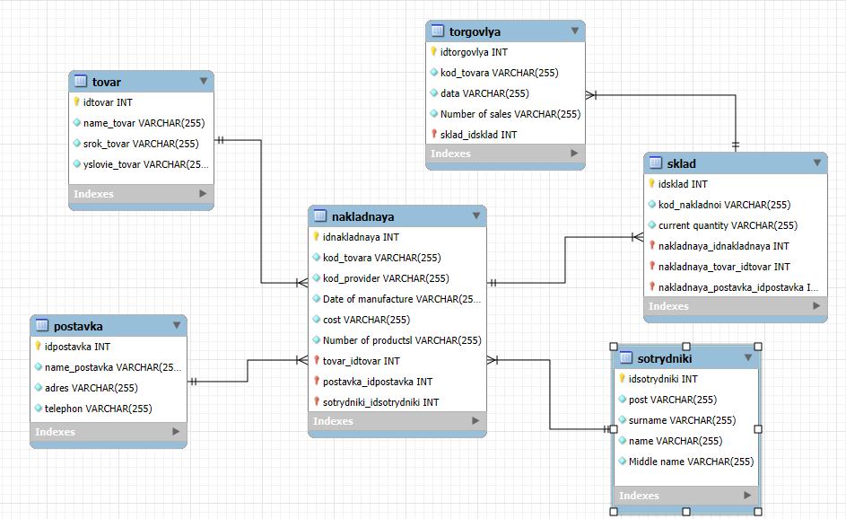

База данных для продуктового магазина


Типовые запросы:
Данный запрос добовляет поставщиков
```sql
INSERT INTO mydb.postavka (idpostavka, name_postavka, adres, telephon)
VALUES (4, 'Поставщик ООО Радумля', 'г. Яроласвль, ул. Колотушкина, д.23', '+7 (499) 545-55-78');
```
данный запрос выводит всех поставщиков
```sql
SELECT * FROM mydb.postavka;
```
Данный запрос добовляет товар
```sql
INSERT INTO mydb.tovar (idtovar, name_tovar, srok_tovar, yslovie_tovar)
VALUES (4, 'Яблоки', '11 дней', 'Хранить при температуре от -2 до +20°C');
```
Данный запрос выводит все товары
```sql
SELECT * FROM mydb.tovar;
```
Данный запрос добовляет сотрудников
```sql
INSERT INTO mydb.sotrydniki (idsotrydniki, post, surname, name, `Middle name`)
VALUES 
(4, 'Продавец', 'Ерёменко', 'Анна', 'Николаевна'),
(5, 'Кассир', 'Иванов', 'Егор', 'Петрович'),
(6, 'Кладовщик', 'Спиридонов', 'Андрей', 'Тимофеевич');
```
Данный запрос показывает всех сотрудников
```sql
SELECT * FROM mydb.sotrydniki;
```
View-представление:
Данное представление объединяет данные из различных таблиц, предоставляет комплексную информацию:
```sql
SELECT * FROM mydb.sklad_tovar_view;
```
Хранимые процедуры:
```sql
DELIMITER $$
DROP PROCEDURE IF EXISTS mydb.sell_product $$
CREATE PROCEDURE mydb.sell_product(
    IN p_sklad_id INT,
    IN p_quantity INT
)
BEGIN
    DECLARE current_qty INT DEFAULT NULL;


    SELECT CAST(`current quantity` AS UNSIGNED)
    INTO current_qty
    FROM mydb.sklad
    WHERE idsklad = p_sklad_id;


    IF current_qty IS NULL THEN
        SIGNAL SQLSTATE '45001'
        SET MESSAGE_TEXT = 'Склад с таким ID не найден';
    END IF;


    IF current_qty < p_quantity THEN
        SIGNAL SQLSTATE '45000'
        SET MESSAGE_TEXT = 'Недостаточно товара на складе';
    END IF;


    SELECT 'Найдено' AS status_message;

  
    UPDATE mydb.sklad
    SET `current quantity` = CAST(current_qty - p_quantity AS CHAR)
    WHERE idsklad = p_sklad_id;

END$$

DELIMITER ;
```
